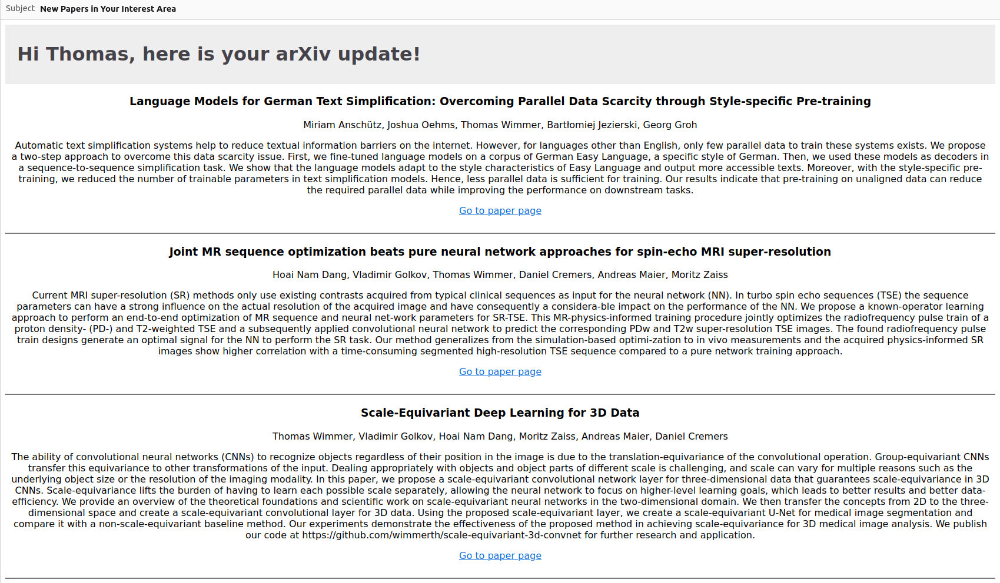

# arxivscan

A simple script to get email notifications for new papers on [arxiv.org](https://arxiv.org).

## Installation and Setup

1. Clone the repository
2. Install the required packages:

```
conda create -n arxivscan python=3.9
conda activate arxivscan
python -m pip install --upgrade pip
pip install arxiv
```

3. Create an app password for your gmail account (https://support.google.com/accounts/answer/185833?hl=en)
4. Add your gmail address and app password as environment variables and reactivate the environment:

```
conda env config vars set ARXIVSCAN_EMAIL=<your gmail address>
conda env config vars set ARXIVSCAN_PASSWORD=<your app password (16 digits)>
conda deactivate
conda activate arxivscan
```

5. Run the script:

```
python main.py
```

Optional arguments are:

- `--config`: Path to the config file (default: `config.json`)
- `--interests`: Lets you add interests to an existing config file in an interactive dialog

This project is currently still *work-in-progress* and you need to call the program manually to receive the notifications
email in case there are new papers. I am working to add the functionality to run the script as a service on a server or
to run it on startup / periodically on your local machine.

## Example Mail Notification

